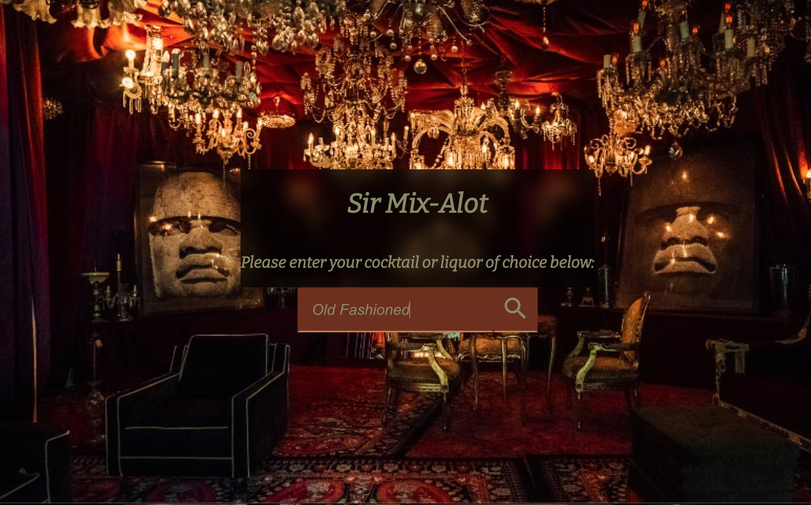
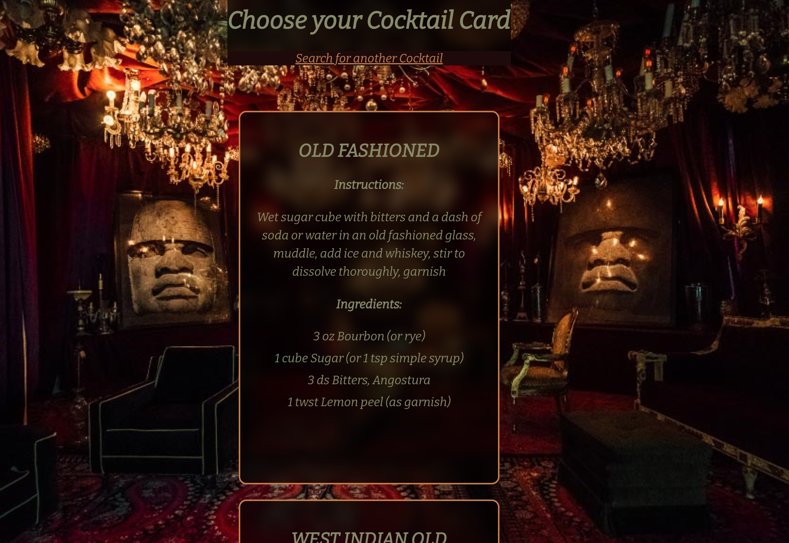

# Sir-Mix-Alot
> React App that takes users input and calls the cocktail API.

> Live demo [_here_](sir-mix-alot.surge.sh). <!-- If you have the project hosted somewhere, include the link here. -->

## Table of Contents
* [General Info](#general-information)
* [Technologies Used](#technologies-used)
* [Features](#features)
* [Screenshots](#screenshots)
* [Setup](#setup)
* [Usage](#usage)
* [Project Status](#project-status)
* [Room for Improvement](#room-for-improvement)
* [Acknowledgements](#acknowledgements)
* [Contact](#contact)
<!-- * [License](#license) -->

## General Information
- By entering a cocktail of choice either by name or liquor type the call returns up to ten recipe choices.
- What problem does it (intend to) solve? - 
       ~indecisvness at the bar or just being a great host 
- What is the purpose of your project?
        ~To give the user a variety of cocktails to try 
- Why did you undertake it?
        ~Hosting gatherings for friends and family I figured this would make 
        deciding what drinks to serve easier. 
<!-- You don't have to answer all the questions - just the ones relevant to your project. -->

## Technologies Used
- Axios - version 1.3.4
- React Router Dom - version 6.8.1
- JavaScript 

## Features
List the ready features here:
- Mobile Compatible
- Renders Cocktail Searches

## Screenshots

<!-- If you have screenshots you'd like to share, include them here. -->

## Setup
-Fork and clone from git repository
-From terminal inital startup run: npm i

## Project Status
Project is: √ in progress_ / _complete_ / _no longer being worked on_. 

## Room for Improvement
Room for improvement:
- Enhance ui/ux

To do:
- make app more mobile friendly
- add like buttons and comments for recipes

## Acknowledgements
Give credit here.
- Many thanks to my instructor Jeremy Taubman at General Assembly and the TAs Kristina, Tiffany, Brittany, Tylus and Sebastian.

## Contact
Created by (link to personal profile here ) - feel free to contact me!

<!-- Optional -->
<!-- ## License -->
<!-- This project is open source and available under the [... License](). -->

<!-- You don't have to include all sections - just the one's relevant to your project -->